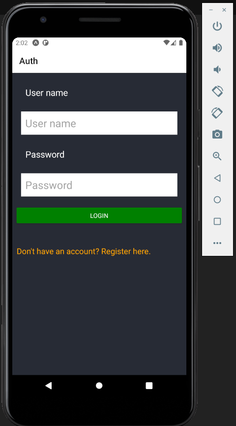

<h1 align="center">
    
</h1>

<h3 align="center">
  Movie Rater - Rate the movies you watched and save them
</h3>

<p align="center">
  <a href="https://www.linkedin.com/in/wellington-fidelis-7b02b167/"></a>
  
  <a href="https://github.com/WellingtonFidelis/movie-rater-app/commits/master"></a>
  
</p>

<p align="center">
  <a href="#-about-the-project">About the project</a>&nbsp;&nbsp;&nbsp;|&nbsp;&nbsp;&nbsp;
  <a href="#-technologies">Technologies</a>&nbsp;&nbsp;&nbsp;|&nbsp;&nbsp;&nbsp;
  <a href="#-getting-started">Getting started</a>&nbsp;&nbsp;&nbsp;|&nbsp;&nbsp;&nbsp;
  <a href="#-how-to-contribute">How to contribute</a>&nbsp;&nbsp;&nbsp;|&nbsp;&nbsp;&nbsp;
  <a href="#-license">License</a>
</p>

<p align="center">
  
</p>

## 🧸 **About the project**

This project was developed with a course of Reacj.js and Django framework &nbsp;💜

See more pictures with the app working below

## **Backend**

### 🚀 Technologies

Technologies that I used to develop this application

- [Python](https://www.python.org/)
- [Django](https://www.djangoproject.com/)
- [Django-CORS-Headers](https://pypi.org/project/django-cors-headers/)
- [Django-Rest-Framework](https://www.django-rest-framework.org/)

### 💻 Getting started

You need of the same things.

### Requirements

- [Python](https://www.python.org/)
- [Python-venv](https://packaging.python.org/guides/installing-using-pip-and-virtual-environments/)

```bash
$ git clone https://github.com/WellingtonFidelis/movie-rater-app.git && cd backend/
```

In the directory, create a .env file with .env-sample variables.

Follow the steps below.

#### **Windows**

```bash
# Installing python virtual environment
$ py -m pip install --user virtualenv
# Creating new virtual environment called 'venv'
$ py -m venv env
# Activating virtual environment
$ .\env\Scripts\activate
# Installing all depedences
$ py -m pip install -r requirements.txt
# Making the migrations
$ py ./manage.py makemigrations
# And run the migrate
$ py ./manage.py migrate
# Run server with your local IP with port 8000
$ py ./manage.py runserver 199.199.199:8000
# Well done, backend is started!
```
*To stop virtual environment just type deactive and enter.*
#### **Linux**

```bash
# Installing python virtual environment
$ python3 -m pip install --user virtualenv
# Creating new virtual environment called 'venv'
$ python3 -m venv env
# Activating virtual environment
$ source env/bin/activate
# Installing all depedences
$ python3 -m pip install -r requirements.txt
# Making the migrations
$ python3 manage.py makemigrations
# And run the migrate
$ python3 manage.py migrate
# Run server with your local IP with port 8000
$ python3 manage.py runserver 199.199.199:8000
# Well done, backend is started!
```
*To stop virtual environment just type deactive and enter.*

### **Web**

_Obs.: Before to continue, be sure to have the API running_

In the directory, create a .env file with .env-sample variables.

```bash
# Starting from the project root folder, go to web folder
$ cd web/movie-rater/
# Install the dependencies
$ npm install
# Or
$ yarn
# Start the client
$ npm start
# Or
$ yarn start
```

### **Mobile**

_Obs.: Before to continue, be sure to have the API running_

```bash
# Starting from the project root folder, go to web folder
$ cd web/MovieRater/
# Install the dependencies
$ npm install
# Or
$ yarn
# Start the client
$ npm start
# Or
$ yarn start
```

## 🤔 **How to contribute**

**Make a fork of this repository**

```bash
# Fork using GitHub official command line
# If you don't have the GitHub CLI, use the web site to do that.
$ gh repo fork WellingtonFidelis/movie-rater-app
```

**Follow the steps below**

```bash
# Clone your fork
$ git clone your-fork-url && cd movie-rater-app
# Create a branch with your feature
$ git checkout -b my-feature
# Make the commit with your changes
$ git commit -m 'feat: My new feature'
# Send the code to your remote branch
$ git push origin my-feature
```

After your pull request is merged, you can delete your branch


## :camera: Pictures

<p align="center">
    
    
    
    
    
    
    
</p>

</p>
</p>

## 📝 License

This project is licensed under the MIT License - see the [LICENSE](LICENSE) file for details.

---

Made with 💜&nbsp; by <strong>Wellington Fidelis</strong> 👋 &nbsp;[See my linkedin](https://www.linkedin.com/in/wellington-fidelis-7b02b167/)
